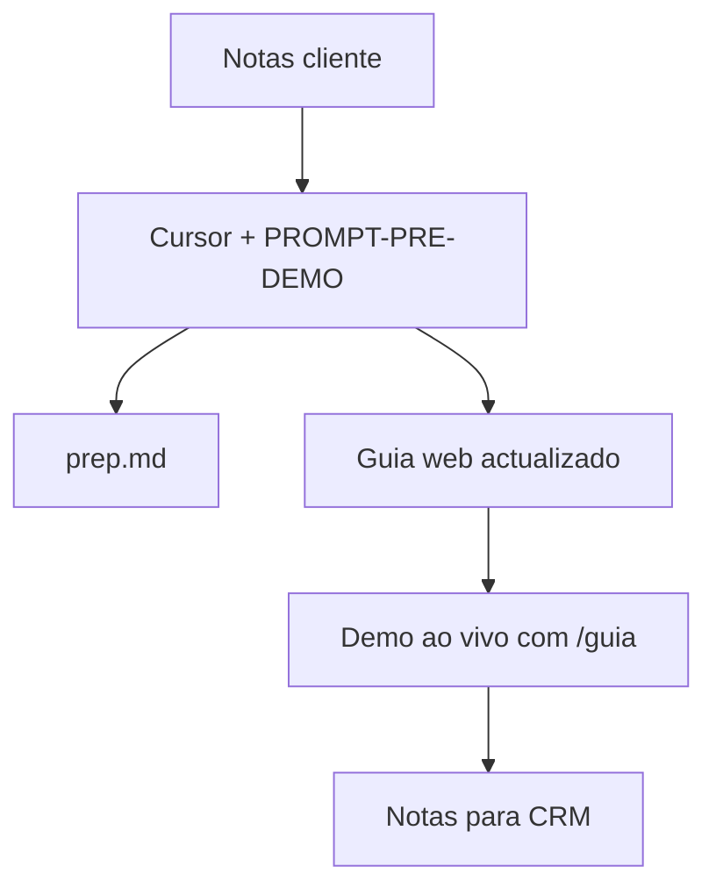

# Playbook — Preparação Pré-Demo Factorial

## Checklist rápido

- [ ] Pasta duplicada ou `demo/clientes/{slug}/` criada com `novo-demo.sh`
- [ ] `transcricao/reuniao.txt` com notas de pesquisa
- [ ] `cliente.config.json` preenchido
- [ ] Prompt `PROMPT-PRE-DEMO.md` executado no Cursor
- [ ] `demo/clientes/{slug}/prep.md` gerado
- [ ] `demoGuideSteps.ts` e `constants.ts` actualizados
- [ ] `npm run build` sem erros
- [ ] Guia testado em `/guia` (discovery checklist + notas)

## Fluxo recomendado



## Repo GitHub (opcional)

1. New repository → nome = `repoName`
2. Na pasta local:

```bash
git init
git add -A
git commit -m "Add Factorial pre-demo guide for [Client Name]"
git branch -M main
git remote add origin https://github.com/VictorHGutierrez-cloud/REPO.git
git push -u origin main
```

3. Settings → Pages → **GitHub Actions**

## vite.config.ts

```ts
const repoBase = "/nome-do-repo/";
```

URL local: `http://localhost:8080/nome-do-repo/guia`

## Documentação Factorial

| Tipo | Fonte | Uso |
|------|-------|-----|
| Produto / UI | help.factorialhr.com | Demo e respostas técnicas |
| API | apidoc.factorialhr.com | Integrações |
| Comercial interno | factorial-funcionalidades-modulos.md | Bundles/preços — não citar como doc de produto |

Ver `docs/FONTES-DOCUMENTACAO.md`.

## Revisão humana antes da demo

1. Nome do cliente correcto no guia
2. Factos do cliente alinhados com notas de pesquisa (nada inventado)
3. Módulos em foco correspondem às dores prováveis
4. Funcionalidades Factorial citadas têm link do help center
5. Payroll: Factorial não processa — só sincroniza (se aplicável)

## Problemas comuns

| Problema | Solução |
|----------|---------|
| Página branca no GitHub | `vite.config.ts` base = `/repoName/` |
| `/guia` dá 404 ao refrescar | Entrar pela landing → Open demo guide |
| Build falha | `npm ci` e verificar imports |
| Agent inventa feature | Reexecutar prompt; verificar regras em `.cursor/rules/` |

## Referências

- Início: `COMECE-AQUI.md`
- Prompt: `docs/PROMPT-PRE-DEMO.md`
- Vídeos: `docs/CATALOGO-DEMOS.md`
- Design: `Design/`
